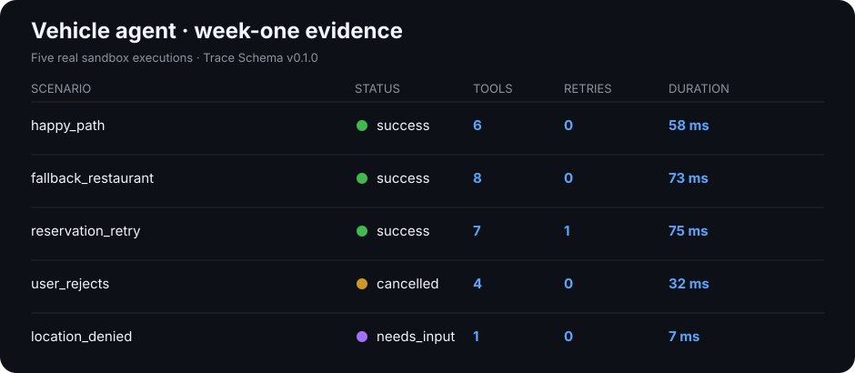

# Agent Harness

> A modular harness for building reliable AI agents.

Agent Harness provides the infrastructure around a model: state, context, memory, planning, tools, perception, execution, and extension points. The goal is to make agent behavior easier to compose, inspect, and improve without coupling every experiment to one monolithic application.

## Executable vehicle demo

The first vertical slice turns this Chinese voice request into a safe,
observable workflow:

> 帮我就近找家有五人包间的川菜馆，导航过去并帮我同步先预定下包间

The agent retrieves a synthetic vehicle location, searches nearby Sichuan
restaurants, checks routing and private-room availability concurrently, asks
for confirmation, creates an idempotent reservation, and starts navigation.

```bash
python3 -m examples.in_car_restaurant_agent \
  --scenario happy_path \
  --trace /tmp/happy-path.jsonl
```

Run all five reproducible scenarios and regenerate the evidence:

```bash
python3 scripts/run_week_one.py
```



The generated traces conform to
[Agent Trace Schema v0.1.0](https://github.com/tinaxiaxiao/agent-evaluation/blob/main/traces/schema/v0.1.0/trace.schema.json).
All locations, restaurants, routes, confirmations, and reservations in this
demo are synthetic. The runtime execution, concurrency, failure recovery,
durations, and trace events are real.

## Why this repository exists

An agent is more than a model call. Useful systems need clear contracts for what the agent knows, how it decides, what it can do, and how each action is observed. This repository keeps those responsibilities separate while making them work as one runtime.

## Architecture

```text
agent-harness/
├── runtime/       # Lifecycle, state, events, and orchestration
├── context/       # Context assembly, budgeting, and retrieval
├── memory/        # Short- and long-term memory interfaces
├── planner/       # Task decomposition and policy selection
├── tools/         # Tool contracts, registry, and invocation
├── perception/    # Inputs from text, files, browser, and other modalities
├── execution/     # Action execution, retries, and recovery
├── plugins/       # Extension points and integrations
├── examples/      # End-to-end reference agents
└── design-notes/  # Architecture decisions and design explorations
```

## Design principles

- **Composable:** each subsystem has a small, explicit interface.
- **Observable:** important decisions and actions produce inspectable events.
- **Replaceable:** planners, memory backends, and tools can evolve independently.
- **Recoverable:** execution failures are expected, classified, and handled.
- **Evaluation-ready:** runs emit traces that can be consumed by `agent-evaluation`.

## Roadmap

- [x] Define the minimal runtime and event model
- [ ] Specify context and memory interfaces
- [x] Add one complete reference agent in `examples/`
- [x] Emit a versioned trace format for evaluation
- [ ] Add plugin discovery and lifecycle hooks

## Relationship to Agent Evaluation

Agent Harness builds and runs agents. [**Agent Evaluation**](https://github.com/tinaxiaxiao/agent-evaluation) consumes their tasks, outputs, and traces to measure quality, reliability, cost, and regressions.

## Status

The first end-to-end sandbox example is executable and tested. Interfaces are
still pre-1.0 and will evolve as real map, speech, and reservation adapters are
introduced.
