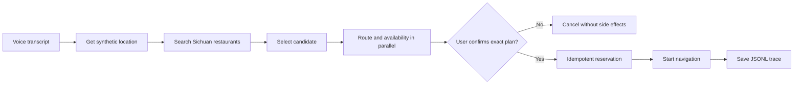
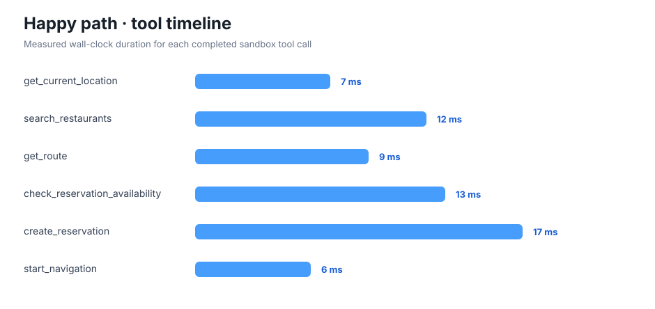

# In-car Restaurant Agent

This is one deliberately narrow vehicle-agent example built to prove the
smallest complete Agent Harness loop.

## Request

> 帮我就近找家有五人包间的川菜馆，导航过去并帮我同步先预定下包间

The fixture parser extracts cuisine, party size, private-room requirement,
nearby-location strategy, inferred arrival-time reservation, and navigation
intent. ASR is represented as a fixture event in week one.

## Safe execution flow



The agent always states the selected restaurant, ETA, reservation time, room
type, and cancellation policy before it receives a scoped confirmation token.
The reservation and navigation tools reject calls without that token.

## Run

From the repository root:

```bash
python3 -m examples.in_car_restaurant_agent --scenario happy_path
```

Available scenarios:

- `happy_path`: the nearest valid restaurant is available.
- `fallback_restaurant`: the first room is unavailable, so the second candidate is selected.
- `reservation_retry`: the first booking response times out; an idempotent retry recovers one booking.
- `user_rejects`: the user rejects the exact plan; no side effects occur.
- `location_denied`: location permission is unavailable; the agent asks for input and stops.

Generate every trace, the summary, and both SVG charts:

```bash
python3 scripts/run_week_one.py
```

## Evidence




The machine-readable outputs are in [`artifacts/`](artifacts/). Every JSONL
file was generated by executing the runtime and validated against
[Agent Trace Schema v0.1.0](https://github.com/tinaxiaxiao/agent-evaluation/blob/main/traces/schema/v0.1.0/trace.schema.json).

## Scope

This is a sandbox demonstration, not a live restaurant-booking product. It
does not call a real map, merchant, speech, or vehicle service, and it does not
store real coordinates or personal reservation details.
